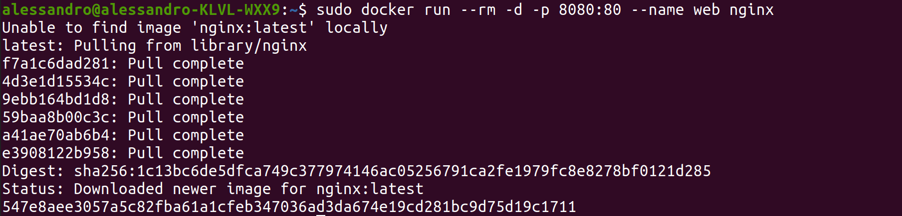

# nginx-docker

En esta práctica vamos a crear un docker en el que correremos la imagen de **NGINX**. 

## Parte A

Empleamos el siguiente comando para ejecutar el docker en Nginx. No hace flata descargarse la ISO de Nginx, docker lo hace todo por nosotros ;).

``` 
sudo docker run --rm -d -p 8080:80 --name web nginx
```


Al escribir en nuestro navegador la ruta *localhost:8000* visualizaremos la web default de Nginx.


Cerramos la web ejecutando el comando
```
sudo docker stop web
```

Para modificar el contenido de la web debemos dirigirnos al directorio **Documentos** y crear una **carpeta nginx**. Dentro de esta última carpeta crearemos otro directorio llamado **site-content**. Dentro añadimos un archivo **index.html** con nuestro html personalizado.

Al modificar el html ejecutamos el siguiente comando
``` 
docker run --rm -d -p 8080:80 --name web -v ~/Documentos/nginx/site-content:/usr/share/nginx/html nginx
```

El resultado es este: 


### Crear una imagen personalizada

Para crear una imagen personalizada necesitamos crear un Dockerfile y agregarle nuestros comando.

En el mismo directorio creamos el archivo Dockerfile y escribimos estos comandos.

## PARTE B: 

